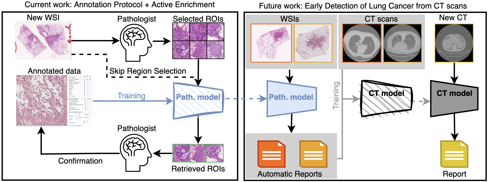
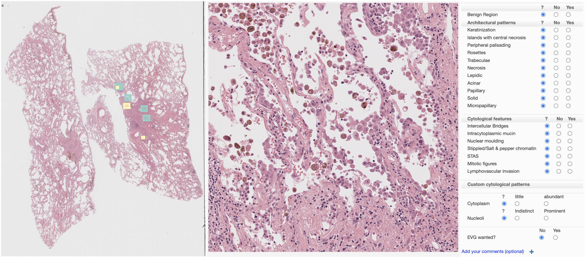
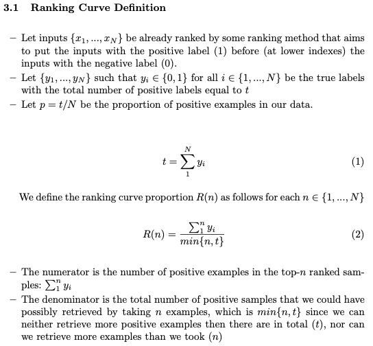
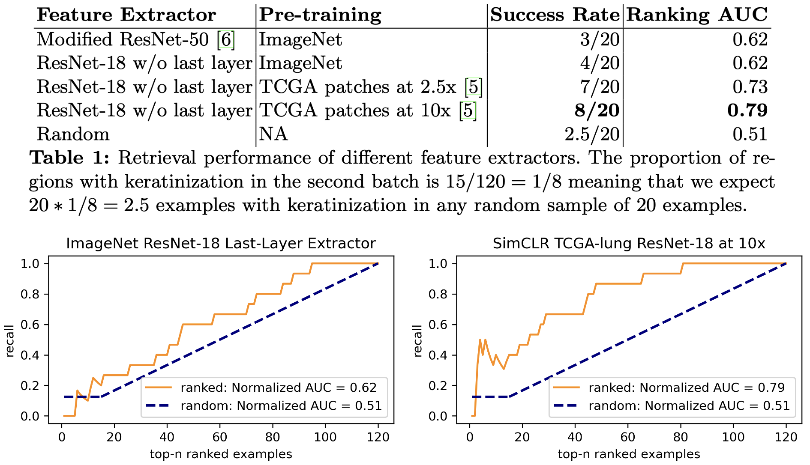
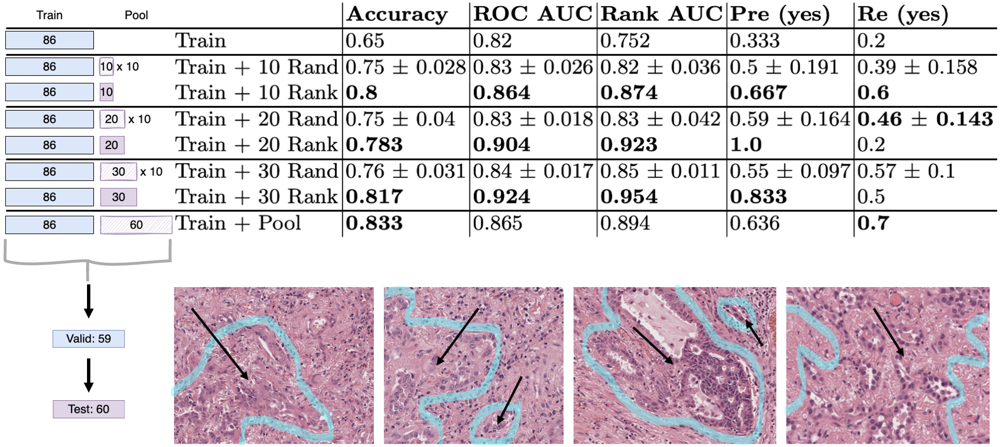

# Active Data Enrichment by Learning What to Annotate in Digital Pathology

* Published version: [paper](https://link.springer.com/chapter/10.1007/978-3-031-17979-2_12), [supplementary material](https://static-content.springer.com/esm/chp%3A10.1007%2F978-3-031-17979-2_12/MediaObjects/539685_1_En_12_MOESM1_ESM.pdf)
* Pre-review pdfs (original submission): [paper](./paper-pre-review-version/submitted-paper-with-names-for-ora.pdf), [supplementary material](./paper-pre-review-version/submitted-supplementary-with-names-for-ora.pdf). This version of the contribution has been accepted for publication, after peer review but is not the Version of Record and does not reflect post-acceptance improvements, or any corrections. The Version of Record is available online at: http://dx.doi.org/10.1007/978-3-031-17979-2_12. Use of this Accepted Version is subject to the publisher’s Accepted Manuscript terms of use https://www.springernature.com/gp/open-research/policies/accepted-manuscript-terms

______

* The paper, has been published as part of the [CaPTion](https://caption-workshop.github.io/) workshop at [MICCAI 2022](https://conferences.miccai.org/2022/en/).
* The work was presented in Singapore on the 22nd of September 2022.
* This work was done as part of the [DART Lung Health Project](https://dartlunghealth.co.uk/)

## Contributions Summary

* Proposed a comprehensive annotation protocol for lung cancer pathology
* Proposed a new ranking metric for comparing image retrieval methods
* Fine-tuned ResNet for predicting pattern presence on regions from pathology images

## Overarching Project



Together with my colleagues at we are collecting a dataset
(as part of the [DART Lung Health Project](https://dartlunghealth.co.uk/)) that will
help us find new clinically-relevant features on chest CT images
that can potentially allow to reduce the number of invasive procedures
and help preventing cancer by detecting it earlier. 

First, we aim to train a model that would
mimic the diagnosis process pathologists follow when reviewing
histology slides (which is the focus of the current work).
Then, we aim to use the predictions from histology images in a
combination with the corresponding chest CTs in order to find
new relevant features on these CT scans.

## Annotation Protocol



To achieve the goal of the overarching project we developed a comprehensive
lung cancer pathology annotation protocol that closely mimics the pathologist workflow.
First, the pathologist is asked to select enough regions relevant to make the diagnosis.
Second, the pathologist annotates these regions marking the presense and abscence of the 
morphological patterns outlined in the WHO 2021 guidelines for lung cancers.

## Evaluation Metric: Ranking Curve AUC

As our data collection is ongoing we do not know how many annotated datasets can be generated. Hence we propose a metric to measure the retrieval
performance for variable number of examples: Ranking Curve AUC. Our metric is similar to ROC AUC used for measuring classification performance.

Here we provide the formal definition. See [supplementary material](https://static-content.springer.com/esm/chp%3A10.1007%2F978-3-031-17979-2_12/MediaObjects/539685_1_En_12_MOESM1_ESM.pdf) (or the pdf with [pre-review supplementary material](./paper-pre-review-version/supplementary_material_submission_2022-06-29.pdf) if you do not have access to the former option).




## Unsipervised Retrieval

For one of the patterns (keratinization), we only had 1 example in the first batch of annotated images. Hense, we used unsupervised retrieval to rank the pre-selected regions from the second batch. With the feature extractor pre-trained on patches from TCGA lung extracted at 10x, we can retrieve 2/3 (10/15) regions with keratinizations from only 1/3 (40/10) ranked regions.




## Supervised Retrieval

For acinar pattern, we simulated the process of adding ranked or randon images from the "pool" set into the training set. The conclusion is that adding 10 ranked images results in greater improvements to the model performance on the unseen test set than adding 10, 20, or 30 random images.



The 4 regions shown, contain acinar pattern. They were picked from the top-10 ranked pool set examples returned by our method for acinar pattern. Solid arrows point at areas confirmed and delineated by the pathologist to contain acinar pattern, thus validating the results.


## Acknowledgements

George Batchkala is supported by Fergus Gleeson and the EPSRC Center for Doctoral Training in Health Data Science (EP/S02428X/1).
Tapabrata Chakraborti is supported by Linacre College, Oxford. The work was done as part of DART Lung Health Program (UKRI grant 40255).

The computational aspects of this research were supported by the Wellcome
Trust Core Award Grant Number 203141/Z/16/Z and the NIHR Oxford BRC. The views
expressed are those of the author(s) and not necessarily those of the NHS, the
NIHR or the Department of Health.

## Cite

```
@InProceedings{10.1007/978-3-031-17979-2_12,
title="Active Data Enrichment by Learning What to Annotate in Digital Pathology",
author="Batchkala, George
    and Chakraborti, Tapabrata
    and McCole, Mark
    and Gleeson, Fergus
    and Rittscher, Jens",
editor="Ali, Sharib
    and van der Sommen, Fons
    and Papie{\.{z}}, Bart{\l}omiej W{\l}adys{\l}aw
    and van Eijnatten, Maureen
    and Jin, Yueming
    and Kolenbrander, Iris",
booktitle="Cancer Prevention Through Early Detection",
year="2022",
publisher="Springer Nature Switzerland",
address="Cham",
pages="118--127",
isbn="978-3-031-17979-2"
}
```